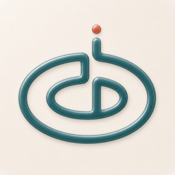
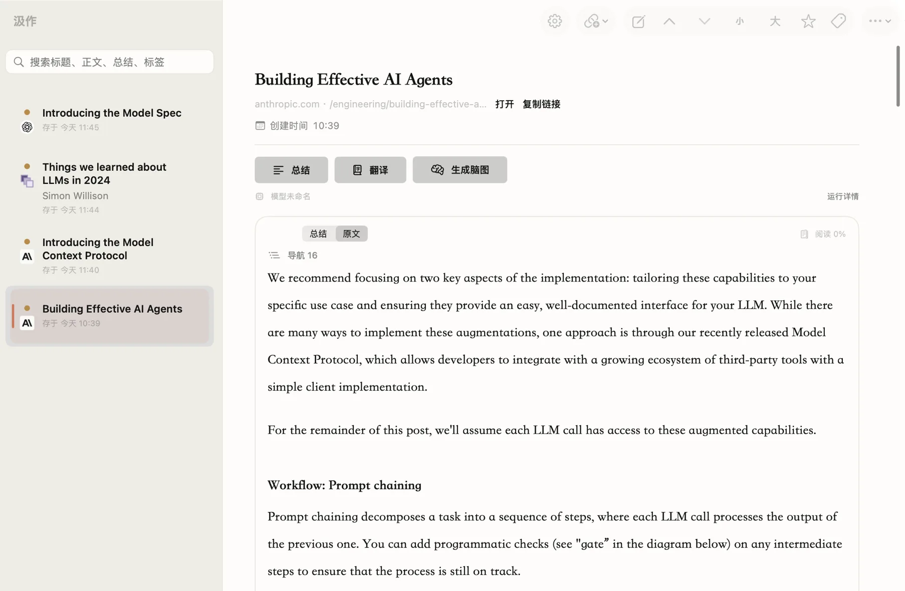

<div align="center">
  
  <h1>汲作</h1>
  <p><strong>我把网页和视频收进自己电脑，做成总结、翻译和脑图。</strong></p>
  <p>
    <a href="https://songxiaor.github.io/jizuo/">官网</a>
    ·
    <a href="https://github.com/Songxiaor/jizuo/releases/latest">下载 macOS 版</a>
    ·
    <a href="https://songxiaor.github.io/jizuo/privacy.html">隐私政策</a>
  </p>
  <p>
    <a href="LICENSE"></a>
    
    
  </p>
  <p>
    
  </p>
</div>

## 我为什么做汲作

这是我做的第一个 macOS 应用。

收藏很容易，真正读完很难。文章散在各个网站，视频没法很快看文字，复制到聊天工具里的原文和生成结果又会散掉。我想把采集、理解和再读，放进一份只存在自己电脑上的资料里。

## 我怎么用

1. **收进来**。我在 Chrome 打开一篇正在看的页面，点扩展发给汲作；公开链接也可以直接贴进应用。来源、标题、正文和能拿到的媒体，会一起留下来。

2. **先有文字**。普通网页我会抽出正文。视频优先用平台已有字幕；没有字幕时，可以在这台 Mac 上转写，或经我确认后，发给自己配置的在线转写服务。

3. **再读懂**。用我自己的模型做总结、翻译和脑图。转写稿可以先按上下文把听错的词尽量还原，再拿去总结或翻译。

4. **留在自己电脑里**。原文、总结、翻译、脑图、笔记、摘录和标签都在本机。我可以按平台、时间、收藏或标签找，也可以搜标题、正文和生成结果。

5. **带走再用**。单条可以导出成 Markdown、TXT、PDF、Word 或 JSON。脑图可以存成 SVG，也可以和原文一起存成一份 HTML。

## 现在能做什么

| 场景 | 当前能力 |
|---|---|
| 网页采集 | 从 Chrome 当前页面保存标题、正文、选区和来源，也可在 App 中添加公开链接 |
| 视频转写 | 优先使用已有字幕，并为无字幕视频提供本机或在线转写路径 |
| 内容理解 | 总结、翻译、转写稿整理、结构化分析和脑图生成 |
| 阅读与复核 | 原文、总结和翻译分开查看，保留来源，支持转写稿人工校对 |
| 个人资料管理 | 本地历史、全文搜索、平台筛选、标签、收藏、笔记和摘录 |
| 图片文字识别 | 使用 Apple Vision 在本机识别图片文字，图片不会交给在线模型 |
| 导出 | Markdown、TXT、PDF、DOCX、JSON，以及脑图 SVG 和自包含 HTML |

## 内容来源

普通网页都能收。下面这些来源，我另外做了识别或专门采集。

- YouTube
- Bilibili
- 抖音
- 小红书
- X
- 微信公众号
- GitHub
- 知乎
- 今日头条
- Medium
- Substack

我自己日常用的是 **Google Chrome**。网站结构会变，某一家能不能抓稳，以我当下打开的页面为准。我只收自己主动提交、已经有权看的内容，不会去批量采别人的号，也不会绕过登录、付费墙或访问限制。

## 数据和模型

资料默认只在这台电脑上。

- 原文、历史、标签、笔记和生成结果保存在本机。
- 模型密钥放在 macOS 钥匙串，不会写进资料库、日志、导出文件或这个仓库。
- 模型地址、密钥和模型名由我自己填，不绑死某一家。
- 第一次把文字发给某个地址前，应用会告诉我发到哪里，等我确认。
- 图片里的字在本机识别。macOS 26 及以上可以用苹果的本机转写。
- 在线总结、翻译或转写时，只发送做这件事需要的内容，发给我自己选的服务商。

没有汲作账号。打开资料不经过我的服务器。

## 现在发到哪一步

我还在自己用、自己改。下载在 [GitHub Releases](https://github.com/Songxiaor/jizuo/releases/latest)。安装包文件名是 `Jizuo`，就是汲作。

- 需要 macOS 15 及以上。
- 苹果本机视频转写需要 macOS 26 及以上。
- 浏览器扩展和桌面应用在这台电脑上交接，不经过我的服务器。
- 我还没有苹果开发者签名。第一次打开会被系统拦一次，按安装说明到「系统设置 → 隐私与安全性」放行即可。
- 从 v0.2.9 起，应用里可以检查更新；有新版本还是要你确认才会装。v0.2.8 及更早需要先手动升一次。
- 新电脑怎么装、扩展怎么连上，见 [`docs/新机测试指南.md`](docs/新机测试指南.md)。

对外我叫它汲作。仓库和代码里还留着早期名字 `LinkDigest`。

**English:** 汲作 is my local-first macOS app. I capture the page I can already view, keep the source on this Mac, and run summarize, translate, and export with my own OpenAI-compatible models.

## 技术结构

```text
Chrome 当前页面
  → TypeScript / WXT 浏览器扩展
  → Native Messaging + 版本化 JSON
  → SwiftUI macOS App
  → SQLite 本地资料库
  → 我自己配置的模型，或苹果本机能力
```

| 目录 | 内容 |
|---|---|
| `apps/desktop/` | SwiftUI + 少量 AppKit 的 macOS App、核心业务、数据持久化和 Native Host |
| `apps/browser-extension/` | TypeScript、WXT、Manifest V3 浏览器扩展 |
| `contracts/` | Swift 与 TypeScript 共用的 JSON Schema 和测试夹具 |
| `docs/` | 产品范围、架构、验收和发布资料 |
| `site/` | 产品介绍页面 |

更多工程资料见 [`docs/PRD.md`](docs/PRD.md)、[`docs/ARCHITECTURE.md`](docs/ARCHITECTURE.md) 和 [`VERIFY.md`](VERIFY.md)。

## 本地开发

需要 Node.js 22.13 或更高版本、pnpm 11、Swift 6 和 Xcode 16 或更高版本。

```bash
pnpm install

# 构建浏览器扩展
pnpm browser:build

# 构建并测试 macOS 代码
DEVELOPER_DIR=/Applications/Xcode.app/Contents/Developer pnpm swift:test
DEVELOPER_DIR=/Applications/Xcode.app/Contents/Developer pnpm swift:build:debug

# 运行仓库检查
DEVELOPER_DIR=/Applications/Xcode.app/Contents/Developer pnpm check
```

更细的构建、Native Host 安装和验证步骤见 [`VERIFY.md`](VERIFY.md)。

## 我现在不做的

- 只有 macOS，没有 Windows、iPhone、iPad 或 Safari 版。
- 没有账号、云同步、团队协作，也不提供我托管的模型。
- 不会去读整个浏览器的 Cookie，也不会把密钥、Cookie 或 Token 写进这个仓库。
