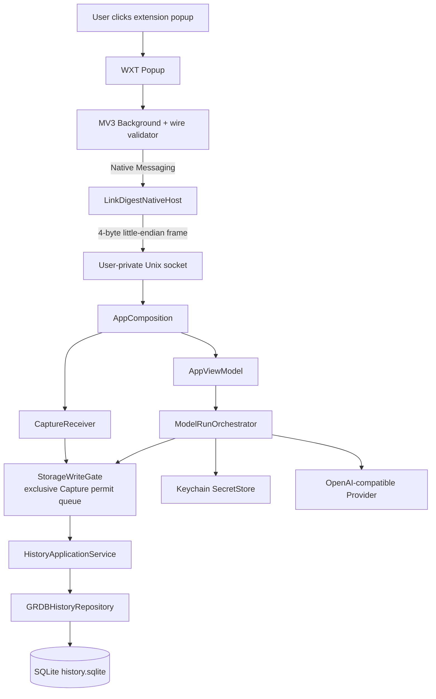

# System architecture

## 当前系统边界

## 已完成模块

| 区域 | 当前实现 | 关键边界 |
|---|---|---|
| Chromium capture | TypeScript/WXT Extension | 仅主动当前页；严格 v1 ACK correlation；Popup 固定安全文案 |
| Native Host / Transport | Swift Host + framing + Unix socket | Host 不持久化正文；4 MiB/timeout/结构化错误 |
| App composition | `AppComposition` | open → accessMode → recovery → write-ready → server |
| Capture | `CaptureReceiver` + `StorageWriteGate` | commit → UI → ACK；并发 permit 线性化；失败后黏性拒写 |
| BYOK Run | `ModelRunOrchestrator` + Provider/Keychain | queued/running/partial/terminal 持久化；取消、stale、secret holdback |
| Persistence | `HistoryRepository` + GRDB 7.11.1 | migration 001、WAL、backup/restore、只读失败边界 |
| Contract | 根 JSON Schema + Swift/TS fixtures | Swift/TypeScript 只共享语言中立 wire contract |

## 02B 冻结事实

- Repository commit 是 Capture UI 与浏览器 `taskAccepted` 的共同闸门。
- 每个 App 生命周期只有一个动态 `StorageWriteGate`；Capture 的 writable 检查、exclusive permit、短同步 Repository 事务和失败降级具有明确线性化语义。
- 运行期 Capture/Run storage failure 黏性关闭 gate；后续 socket Capture 在 Repository 前拒绝，只有新 bootstrap/recovery 生命周期可重建 writable。
- Run 使用同一 typed RunID 与 `run:v1:ui:<runID>`；queued、running、partial、terminal commit 均早于对应 UI。
- Stop 在慢 UI callback 前撤权并取消 Provider/consumer；旧 Run 与 hostile late delta 不能污染新 Run。
- 跨 delta secret 在确认安全前不会进入 UI、Artifact 或数据库。
- App/Core 不 import GRDB，不持有 DatabasePool/Queue 或 SQL；Composition root 只通过 Persistence Adapter 类型装配。
- migration 001 SHA-256 固定为 `2402fd0dcb8293010f3c080af583a98c50af661a200915c321e0faaccfb93b57`；未来只能追加 002+。
- P0-RC-02B 最终独立 Sol 复审 PASS；Hana 主线程最终 Swift 117/117、Web、SwiftPM Debug/Release 与 Xcode 四目标通过。

## 尚未实现

- History Sidebar、详情、单项删除与重启后的浏览交互。
- Markdown/TXT/JSON 导出与原生交互打磨。
- 稳定 Host 安装、升级、卸载、签名、公证与 clean-room RC。

## 不可变边界

- P0 macOS 使用 SwiftUI，AppKit 仅作单职责 bridge。
- Chromium 扩展保持最小权限；不读取 Cookie/Profile。
- P0 local-first；账号、同步、托管模型、Windows、Safari、Q&A 不进入当前范围。
- API Key 只进 Keychain；正文、私人 URL、Token 与 raw error 不进入普通日志。
