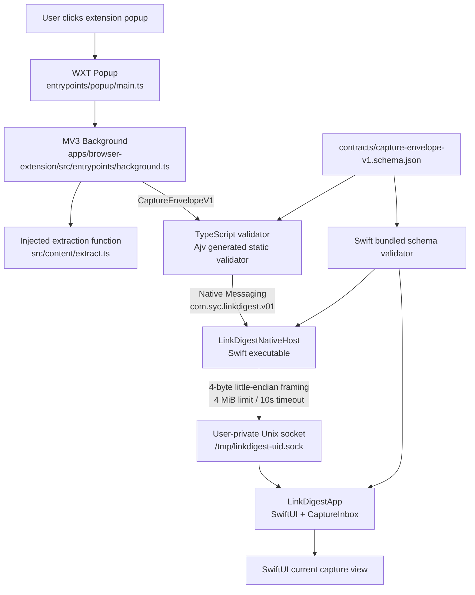
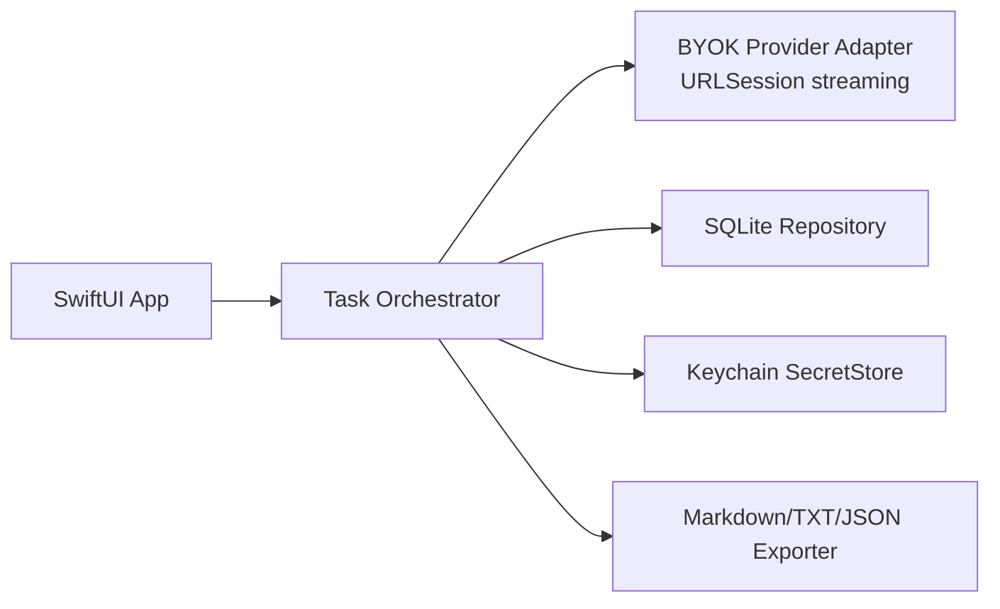

# Architecture

## 当前系统边界

## 实际模块

| 区域 | 当前实现 | 职责 | 不负责 |
|---|---|---|---|
| Browser popup | `apps/browser-extension/entrypoints/popup/main.ts` | 展示当前页标题/字符数，触发发送 | 历史、模型设置、长期诊断 |
| Browser extraction | `apps/browser-extension/src/content/extract.ts` | 读取 selection 或 `article/main/body` 文本 | 绕过登录、读取 Cookie、平台深度适配 |
| MV3 background | `apps/browser-extension/src/entrypoints/background.ts` | 构造 `CaptureEnvelopeV1`、执行合同校验、调用 Native Messaging | 存储正文、调用模型、保存历史 |
| TypeScript contract | `apps/browser-extension/src/contract.ts` + generated validator | 执行 Schema 与字符数 invariant | 作为跨语言唯一真相源；真相源是根 JSON Schema |
| Native Host | `apps/desktop/Sources/LinkDigestNativeHost/main.swift` | Chromium framing、合同校验、APP 可用性与错误映射 | 网页提取、模型调用、数据库业务 |
| Transport | `LinkDigestTransport/Framing.swift`、`UnixSocket.swift` | 4-byte little-endian framing、4 MiB 上限、Unix socket 通信 | 领域任务编排 |
| Core | `LinkDigestCore/Models.swift`、`JSONSchema.swift` | 领域 DTO、错误、Schema 校验、幂等 inbox | UI 与平台安装 |
| App | `LinkDigestApp/LinkDigestApp.swift` | 启动 socket server、接收 capture、更新 SwiftUI | 持久化、BYOK、正式任务列表 |

## 已验证事实

- 根合同 `contracts/capture-envelope-v1.schema.json` 是跨语言唯一合同。
- TypeScript 侧使用 Ajv 生成的静态 validator，避免 Manifest V3 CSP 下的动态代码生成。
- Swift 侧从 Package resource 加载同一 Schema，并执行结构规则与字符数等语义规则。
- Native Messaging 使用 4-byte little-endian framing；frame 上限 4 MiB；正文上限 2,000,000 Unicode scalars。
- Host、Host→APP、APP accepted client 均有 10 秒级有界超时。
- `CaptureInbox` 使用 `idempotencyKey ?? requestId` 做进程内幂等接收。
- Chrome 150 与 Brave 150 真实浏览器验收已通过；Edge 仍待授权安装后验证。

## 计划内但尚未进入当前代码的模块

这些模块属于 V0.2+：当前代码只完成 capture 接收与展示，不应把 PRD 中的 SQLite、Keychain、模型流、历史和导出误读为已实现能力。

## 不可变边界

- P0 桌面 APP 使用 SwiftUI；AppKit 只允许作为单职责 bridge。
- Chromium 扩展使用 TypeScript/WXT；浏览器权限保持 `activeTab`、`scripting`、`storage`、`nativeMessaging` 的最小集合。
- Swift 与 TypeScript 不共享源码类型，只共享版本化语言中立合同。
- P0 local-first；账号、同步、托管模型和 Cloud API 不得成为本地能力前置条件。
- API Key 只能进入 Keychain；正文、私人 URL、Cookie、Token 和秘密不进入普通日志。
- 路线反转必须先记录 Brain reversal，再同步 PRD、Architecture 和验收文档。

## 系统性影响

短期上，独立 Native Host 把 Chromium framing 与 APP 业务隔离，降低扩展和 SwiftUI 互相污染的风险。长期上，它新增了发布与恢复耦合：Host executable、Swift resource bundle、浏览器 manifest、签名、公证、升级和卸载必须被当成一个安装系统验证；否则本地开发成功会在真实用户机器上转化为“扩展找不到 Host / Host 找不到资源 / APP 不可用”的恢复负担。
