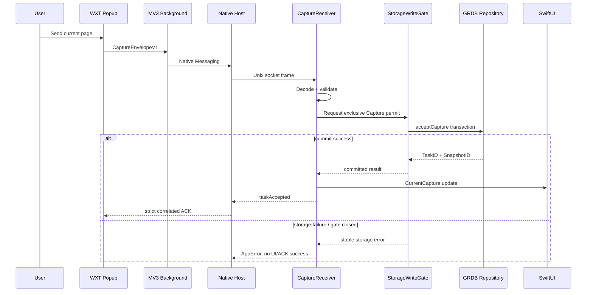
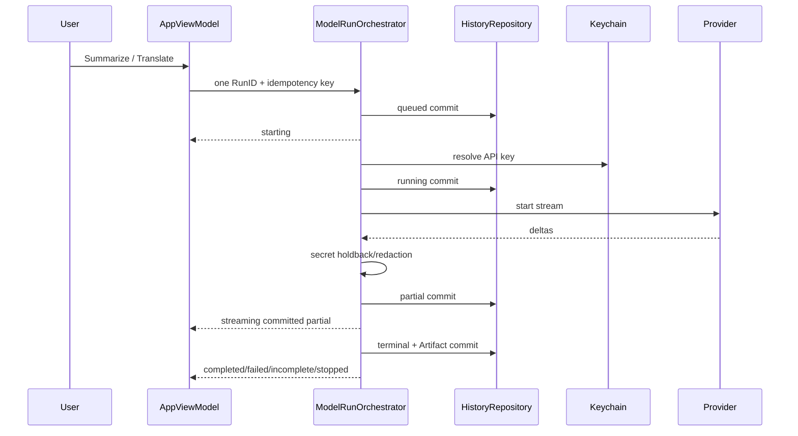
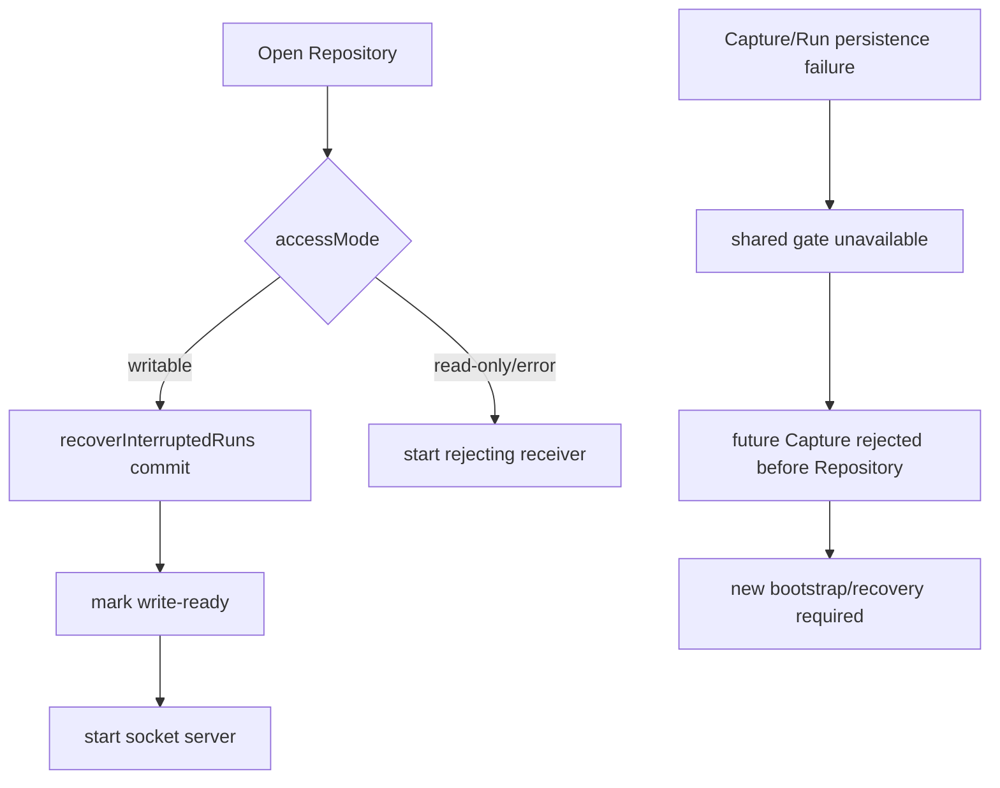

# Key flows

## 当前页 Capture 持久化流

关键语义：并发 Capture 只有一个 permit holder。A 事务失败时 gate 先黏性降级，再拒绝已登记 waiter；后续请求不调用 Repository。duplicate 使用原 TaskID/SnapshotID。

## BYOK Run 持久化流

Stop 先撤销 authority 并取消 Provider/consumer，再等待 UI callback。每次 await 返回后重验 RunID；旧 Run、迟到 delta 与失败 callback 不能覆盖新 Run。

## Storage 失败与恢复

## 下一允许阶段

02B 已关闭。下一阶段只能是 History Sidebar、详情、单项删除与重启恢复的浏览交互；当前尚未开始。导出、发布工程和其它扩展能力继续等待各自阶段。
