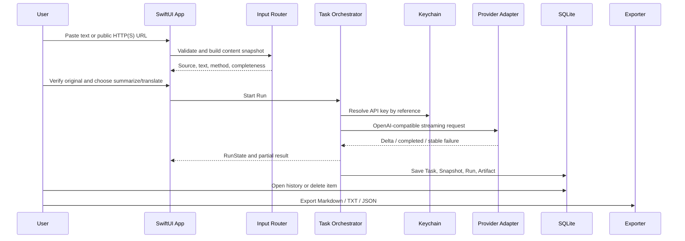
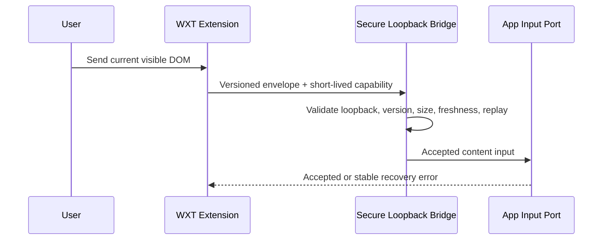

# Key flows

## MAS 首发独立闭环

这条路径必须在 App Sandbox 中、不安装扩展或 Native Host 的情况下通过。当前已实现 BYOK/RunState 部分；独立输入、SQLite 和 Exporter 尚未实现。

## 条件式浏览器输入

只有 sandboxed Release、安全威胁模型和当时的分发可行性都通过后，才启用这条流。失败时首发只保留独立闭环。

## 已验证的开发流

V0.1 的 WXT → Native Messaging → LinkDigestNativeHost → `/tmp` Unix socket → SwiftUI 已证明合同和跨进程可靠性。它继续作为开发证据或未来公证 DMG 候选，不是 MAS 首发主流。

## 恢复原则

- 公开 URL 受限：提示改粘贴已合法可见文字。
- Provider 失败：使用稳定 code；有 partial 时标记 incomplete。
- 用户停止：传播到底层并保留不完整结果。
- migration 失败：只读打开并允许导出，不删除数据库。
- extension bridge 失败：移除增强入口，不影响独立 App。
