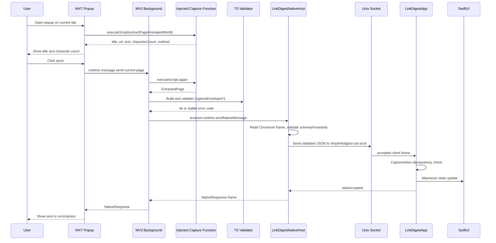
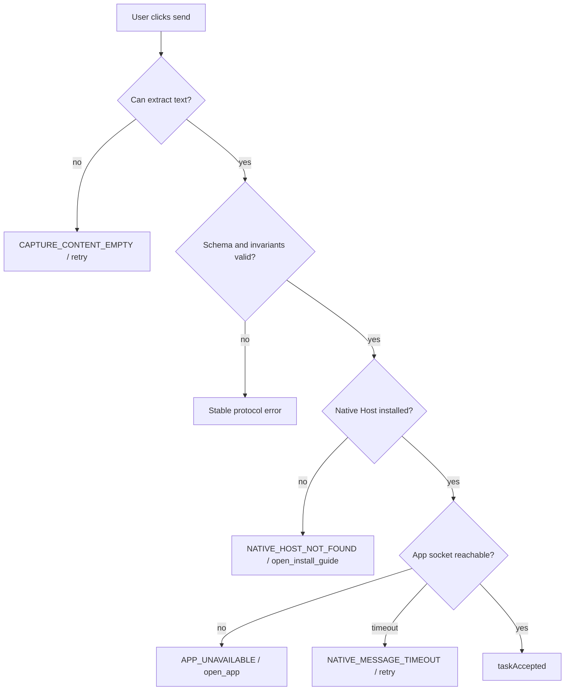
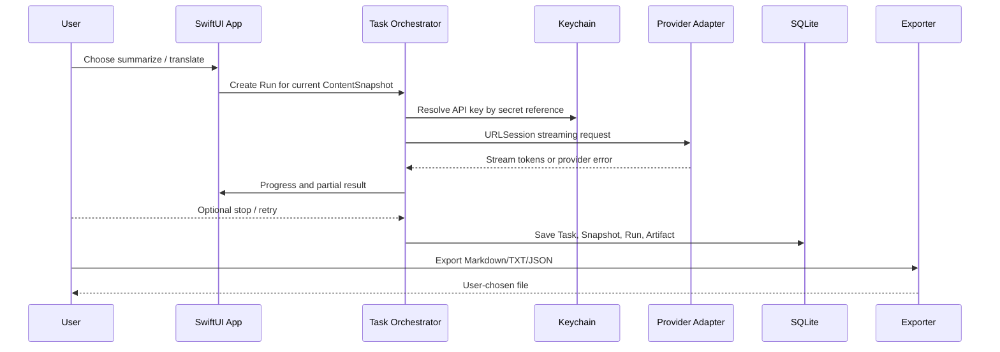

# Key Flows

## V0.1 已实现：当前页发送到 SwiftUI

当前实现重点在交接可靠性：Popup 与 APP 会展示标题、URL、捕获方式、完整性、字符数和正文；还没有创建持久化 Task、模型 Run 或导出 Artifact。

## V0.1 错误与恢复流

恢复边界：Host 不排队正文、不静默拉起 APP、不写业务数据。这个选择让失败更可解释，但会把“用户是否已打开 APP”变成真实工作流的一部分，后续 UI 需要把它讲清楚。

## 后续 P0 本地理解流

## 真实工作流与文档工作流的差异

文档中的 P0 完整循环包括 BYOK、SQLite、Keychain、历史和导出；当前代码中的真实循环停在“当前页正文进入 SwiftUI”。这不是问题，但它影响排期：如果直接开始 UI 打磨，会掩盖更高风险的 Provider streaming、SQLite migration、Keychain failure 和 release install 恢复路径。

## 系统性影响

短期收益是先把最脆弱的跨进程链路变成可测证据。长期成本是用户可见流程跨越浏览器扩展、Host、APP、后续 Provider 和本地存储五个边界；任一边界失败都必须保留稳定错误代码与恢复动作。否则局部优化，例如只让 Popup 显示“失败”，会把系统调试成本转嫁给用户和后续支持。
