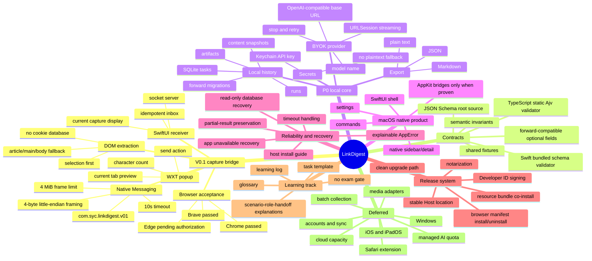

# Feature Mindmap

## 当前功能重心

当前仓库的实际功能重心是 V0.1 capture bridge：从用户主动点击扩展，到 SwiftUI 显示当前页面正文。P0 的 BYOK、SQLite、Keychain、历史和导出已经在 PRD/Architecture 中定界，但尚未进入当前代码闭环。

## 系统性影响

功能树的上半部分是“交接与恢复系统”，下半部分才是“理解与导出产品”。短期如果跳过 Edge 和安装恢复去做模型功能，用户会更早看到价值；长期代价是每次真实浏览器、Host 路径或签名策略变化都会污染模型/历史调试，导致问题难以定位。因此当前顺序应继续先关闭 capture bridge 的浏览器矩阵，再进入 BYOK。
