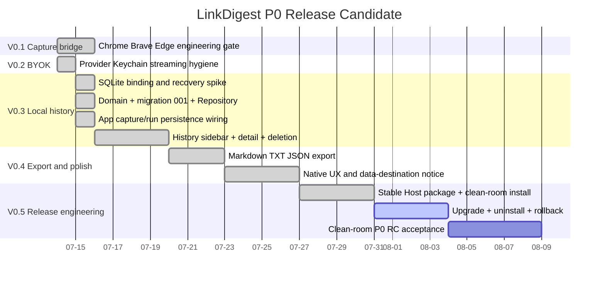

# Roadmap

## P0 Release Candidate 顺序

> 日期只表达依赖顺序，不是交付承诺。自动测试、失败恢复、安全门禁和独立复审通过后才进入下一阶段。

## 已完成

1. Chrome、Brave、Edge 三浏览器 V0.1 工程门禁。
2. V0.2 BYOK、Keychain、streaming、停止、不完整结果、错误恢复与 secret hygiene。
3. GRDB 7.11.1 binding/recovery spike。
4. 正式 Domain、五表 migration 001、GRDB Repository、backup/restore 与 benchmark。
5. P0-RC-02B App composition、启动 recovery gate、Capture/Run persistence wiring、动态 storage 禁写、并发 Capture permit queue、协议 hardening 与独立复审。
6. 02C History Sidebar/详情/删除与 Loop 2 单条导出。
7. Loop 3 原生数据去向确认、设置页连接测试、attempt/generation/revision 并发隔离、冻结授权输出脱敏与最终独立复审。
8. Loop 4 r1 canonical Host config、arm64 Release package、完整 resource bundle、checksum/metadata verifier、manifest renderer、fixed /private/tmp clean-room initial apply/noop/receipt、poisoned TMPDIR 门禁与最终独立 re-review。

## 当前状态

Loop 4 r1 最终独立 re-review PASS，P0/P1/P2 均为 0。实现与复审均完整通过 56 项 deterministic check；删除一次性源码副本 build 后 packaged Host 仍通过 offline/oversize/timeout，缺 bundle 确定失败。真实 HOME、scope 外 poison root 与 worktree 状态保持不变。release extension IDs 仍未冻结，release manifest 继续 fail closed。

下一阶段是 r2 Upgrade + uninstall + rollback。r2 应在 clean-room 中补跨进程 lock、dirfd/openat 路径绑定、事务 journal、SIGKILL/crash recovery、receipt-owned upgrade/uninstall 与完整 rollback；在独立复审通过前不得触碰真实 HOME 或真实浏览器 profile。

## 下游硬门禁

- View/ViewModel 不持有 GRDB 类型、数据库连接或 API Key。
- migration 只追加；失败保留数据库并提供只读逃生口。
- 数据去向确认只记不含秘密的 identity；目的地或 Capture 变化不得复用旧确认。
- Host、资源包、Schema、metadata 与 checksums 作为稳定交付单元；release manifest 在 extension IDs 未冻结时 fail closed。
- r1/r2 工程验证只允许 fixed canonical /private/tmp 下带 sentinel 的 clean-room，不读取 TMPDIR。
- 真实 HOME、真实浏览器 profile、升级/卸载实际 apply、签名、公证和发布必须单独授权。

## 重大授权边界

签名、公证、商店提交、付费、真实用户安装、真实浏览器 profile、真实 Provider 凭据和远程写入仍需 Syc 明确授权。Q&A、云账号、同步、托管模型、Windows、Safari 和媒体下载不进入 P0 RC。
