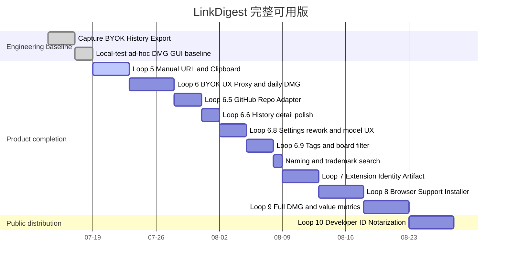

# Roadmap

## P0 完整可用 APP 顺序

> 日期只表达依赖顺序，不是交付承诺；真实凭据、HOME/profile 写入、签名、公证、商店与发布继续使用单独授权门禁。

## 已完成的工程基线

1. Chrome、Brave、Edge 的开发态 Capture → Native Messaging → SwiftUI 工程链。
2. BYOK profile、Keychain、Chat Completions SSE、停止与 secret hygiene。
3. GRDB/SQLite、History、删除和 Markdown/TXT/JSON 导出。
4. 数据目的地确认、连接测试和 local-test ad-hoc DMG/source handoff。
5. Syc 已真实打开 r4b GUI；该证据只关闭“DMG/App 可打开”，不关闭产品可用性。

## 当前状态

当前精确状态为 **GUI_BASELINE_PASS / PRODUCT_INCOMPLETE**；Loop 5 为 **CODE-COMPLETE / VERIFICATION-PENDING**（15 条公开样本补验依赖 Loop 6 代理兼容，现已具备条件，待补跑）。

Loop 6：**工程侧已收口（2026-07-18 终审 PASS）**。Syc 用 r3-fix2 完成真实 BYOK 闭环（DeepSeek 连接、真实翻译、历史入库）；此后错误映射与"Provider 摘要透传"经四轮安全收敛，最终采纳 reviewer 架构建议：自由 Provider body 不跨 Adapter 边界，UI 仅用内部错误码固定文案（决策记录在 ARCHITECTURE.md）。最终 dogfood 候选 **r4-fix3**（DMG `b8fd3cee…30fa7c`，Swift 249/249、gate 76/10、SHA 13/13、18 文件绑定），r2→r4-fix2 全部 SUPERSEDED。剩余仅 Syc 换用 r4-fix3 的日常使用确认。验收发现的详情页元数据空壳与标签需求已转入 Loop 6.6 / 6.9。

## 产品 Loop 顺序（含 2026-07-17/18 规划补丁）

1. Loop 5 — Desktop Input：手动 URL、剪贴板、公开网页抓取、正文提取、失败恢复和 History/CurrentCapture 接线。**验收必须包含 PRD §12 的 20 条真实样本集**（10 静态含 1 条 GitHub README 基线、5 客户端渲染、3 登录可见页记录“引导扩展”降级路径、2 故意失败），并交付 Syc 确认的 GUI 结果图。
2. Loop 6 — BYOK Product UX：主流程可发现设置、真实连接、目的地确认、流式总结/翻译和兼容抽样。**验收含自定义总结 prompt（默认模板 + 用户自定义）与翻译目标语言可选**（不限英译中）。**验收含代理环境兼容（Syc 2026-07-17 确认）**：检测 fake-ip DNS（如 198.18.0.0/15）并给出人话提示与恢复动作；支持经系统代理按域名 CONNECT 连接，保留 SNI/证书名校验与 TLS 信任链，不得因代理放宽 SSRF 防护的其余部分。**Loop 6 结束必须产出一版 Syc 可日常真用的 local-test ad-hoc DMG**（在开启代理的真实环境下手动链接 → BYOK 总结/翻译 → History/导出闭环），作为日常 dogfood 基线，也是“自用 + 发安装包给他人”的最低可交付形态。收尾包含 Syc 验收触发的 UX 批次（侧边栏可收缩、App 图标、设置页四态状态机）与 402/404/4xx 错误映射修复。
3. **Loop 6.5 — GitHub 仓库适配器**（[[github-repo-source-adapter]]）：识别 `github.com/owner/repo` 链接走专属来源适配器——公开仓库 README 原文获取、Markdown 解析、仓库内联图片绝对地址解析与本地缓存展示。边界：只做 README 内联图片引用/缓存，不做通用媒体下载；私有仓库 token 属未来单独授权。该 Loop 同时确立“来源适配器”插件式接缝（fetcher/CapturedDocument 协议），作为后续 arXiv/博客等适配器的模板。
4. **Loop 6.6 — 历史详情精修（Syc 2026-07-18 批准）**：把已有数据接进 UI——详情页元数据填充（操作/模型/创建时间/状态），run 落库补记 Token 用量（SSE usage 块）与估算费用，列表行来源 favicon 与时间格式，对齐 Sam 级别的信息密度。不新增数据面，只做展示层与 run 元数据落库。
5. **Loop 6.8 — 设置页重构与模型体验（Syc 2026-07-17 批准）**：设置页重组为「模型服务」+「生成与数据」两 tab；常用厂商预设（OpenAI/DeepSeek/DeepInfra/OpenRouter/Groq/SiliconFlow/Ollama 本地/自定义，纯 BYOK 不内置任何 key）；`GET /models` 模型下拉 + 手填兜底（**必须复用现有 Provider 传输层与 URL 门禁，不得新开网络面**）；**输出语言统一**（“翻译目标语言”升级为全局输出语言，总结输出跟随）；翻译可选独立模型（默认与总结共用）；「数据去向」透明卡；**设置页允许 `http://127.0.0.1` 本地端点**（复用既有 allowLoopbackHTTP 白名单，仅限 loopback，支持 Ollama 等本地 chat/completions 服务）。随后小步：同语言检测置灰翻译、历史详情重新生成（可临时换模型）、截断透明标注、主流程当前模型可见。**明确不做**：温度/推理档位/长度参数、iCloud 同步、多 Profile 并存、可编辑翻译 prompt、Responses API 适配（opencodex 类本地代理暂不支持，等生态普及再评估）；ChatGPT 订阅接入不进近期 roadmap，仅观察“Sign in with ChatGPT”第三方 GA 后再评估。
6. **Loop 6.9 — 标签与看板筛选（Syc 2026-07-18 批准）**：标签数据表（schema migration）；总结/翻译时由模型产出建议标签（自动）+ 手动增删；侧边栏/看板视图按标签筛选文章。边界：单层标签不做层级，筛选为单选/多选交集，不做智能合集。
7. **命名检索（Loop 7 前置硬门禁）**：正式产品名、商标、域名与图标检索必须在 Loop 7 冻结扩展 ID 与扩展工件之前完成，避免身份冻结后返工。
8. Loop 7 — Extension Artifact：稳定扩展 ID、确定性 Chromium bundle/zip、版本和 Host 绑定。**登录页捕获（浏览器 Cookie 上下文）日常可用依赖本 Loop 与 Loop 8 完成**；在此之前扩展仅开发者模式可用（Syc 2026-07-18 知悉该排期约束）。
9. Loop 8 — Browser Support Installer：APP 内安装/修复/卸载，真实 current-user Host/manifest/receipt 事务与冲突确认。
10. Loop 9 — Integrated Full DMG：App、Host、扩展、安装入口、源码和证据统一交付，完成 Syc 三浏览器端到端测试。**产品价值指标（PRD §11.1）在 Loop 9 验收时测量**，未测量不得宣称达标。

Loop 10 仅处理 Developer ID、hardened runtime、公证、stapling 和公开分发，不反向阻塞 Syc 的本机完整可用版。

## 下游硬门禁

- 手动 URL 的公开抓取不得使用浏览器 Cookie；登录或动态页面必须引导使用扩展。
- 代理兼容不得整体放宽 SSRF 防护：fake-ip 检测、经代理按域名连接时必须保留 hostname SNI、证书名校验与 system trust；不得允许直连私网/test-net 目标。
- API Key 只允许进入 Keychain 和单次短时 Provider 请求，不进入 SQLite、日志、截图、fixture、导出或 Git。
- Extension ID 必须与 Host `allowed_origins` 永久绑定；不得使用 wildcard。
- Production installer 只操作 LinkDigest 自有 basename/receipt；未知旧 manifest 必须显式确认、备份与可恢复，禁止静默覆盖。
- Chrome、Brave、Edge 的真实目录和行为必须现场验证；不得只沿用旧浏览器版本假设。
- Git、真实 Provider、真实 HOME/profile、Developer ID、公证、商店和公开发布继续分别受授权门禁约束。
