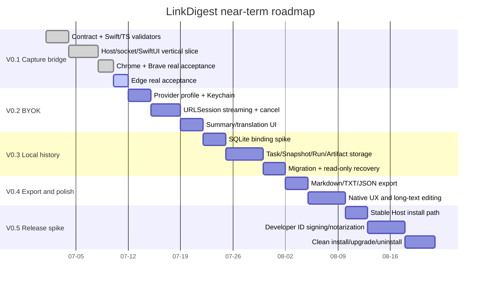

# Roadmap

## 当前顺序

> 日期只是 Mermaid 排序占位，不是承诺；真实启动仍受授权、证书、安装和测试结果约束。

## 已完成

1. P0 收敛为 macOS 原生、SwiftUI + 少量 AppKit、local-first、Chromium-first。
2. Electron/云端/百万容量路线已归档，不再驱动当前实现。
3. `CaptureEnvelopeV1` JSON Schema 成为 Swift 与 TypeScript 的跨语言唯一合同。
4. TypeScript 静态 Ajv validator 与 Swift bundled schema validator 已建立。
5. WXT MV3 扩展、SwiftUI APP、独立 Native Host 与 Unix socket 垂直链路已实现。
6. Host framing、4 MiB 上限、10 秒超时、APP unavailable、stalled client 隔离与 20 次连续发送有证据。
7. Chrome 150 与 Brave 150 真实浏览器验收完成。
8. Native Host 开发安装/卸载脚本边界已有 dry-run、显式目标、备份、symlink 拒绝和只读卸载计划。

## 下一步

1. 获得 Syc 对 Microsoft Edge 外部软件安装的明确授权。
2. 在隔离 Edge Profile 加载同一 WXT MV3 产物，完成固定文章、APP 离线/在线、SwiftUI 字段和 20 次 Release p95。
3. Edge 通过后关闭 V0.1 浏览器矩阵。
4. 进入 V0.2：Provider profile、Keychain secret、OpenAI-compatible streaming、停止/重试、部分结果保存语义。
5. 再进入 V0.3：SQLite binding spike、Task/ContentSnapshot/Run/Artifact、forward migration、只读恢复与导出逃生口。
6. V0.5 再处理稳定 Host 安装目录、Developer ID 签名、公证和安装/升级/卸载；不得把当前 `/tmp` 测试路径包装成发布方案。

## 停止门禁

- 首次 Git commit、Edge 安装、签名账号、证书、公证、发布、远程写入都需要 Syc 当前明确授权。
- Edge 真实验收失败时，先修复 V0.1 capture bridge，不加入模型、SQLite、云端或正式视觉来绕开问题。
- SQLite binding 未完成打包、许可证、迁移和只读恢复验证前，不应把历史功能建成不可迁移的数据孤岛。
- Provider streaming 未通过 fake server 和真实端点抽样前，不应扩展多 Provider 管理。
- 路线再次反转时，先记录 Brain reversal，再同步 PRD、Architecture、Roadmap 和 doctor。

## 系统性影响

短期最诱人的优化是跳过 Edge/安装恢复，直接做 BYOK 让用户看到总结结果；长期系统成本是 capture 边界不稳时，模型、存储和导出都会被迫一起参与排错。当前路线刻意先关闭最底层交接矩阵，是为了缩短后续故障定位路径：页面捕获、Host、APP、Provider、SQLite 每层都能独立证明和恢复。
