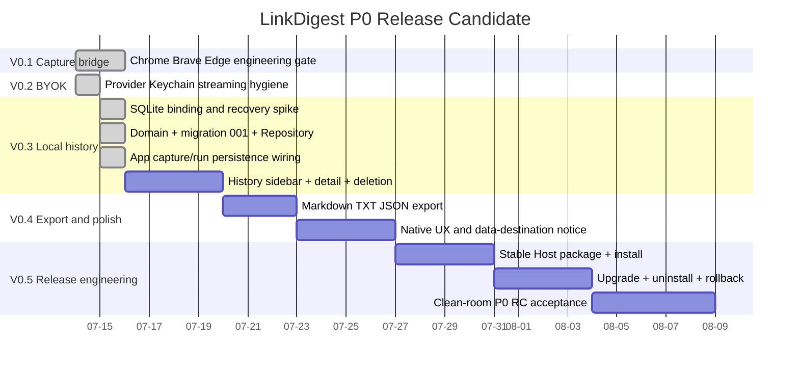

# Roadmap

## P0 Release Candidate 顺序

> 日期只表达依赖顺序，不是交付承诺。自动测试、失败恢复、安全门禁和独立 Sol 审查通过后才进入下一阶段。

## 已完成

1. Chrome、Brave、Edge 三浏览器 V0.1 工程门禁。
2. V0.2 BYOK、Keychain、streaming、停止、不完整结果、错误恢复与 secret hygiene。
3. GRDB 7.11.1 binding/recovery spike。
4. 正式 Domain、五表 migration 001、GRDB Repository、backup/restore 与 benchmark。
5. P0-RC-02B App composition、启动 recovery gate、Capture/Run persistence wiring、动态 storage 禁写、并发 Capture permit queue、协议 hardening与独立复审。最终 Swift 117/117、Web、SwiftPM 和 Xcode 四目标通过。

## 当前状态

02B 已关闭并形成可交接现场。History Sidebar、详情、单项删除与重启恢复是下一允许阶段，但尚未开始。不得越过它直接开发导出或发布工程。

## 下游硬门禁

- View/ViewModel 不持有 GRDB 类型或数据库连接。
- migration 只追加；失败保留数据库并提供只读逃生口。
- 导出使用脱敏 projection 与 `formatVersion: 1`。
- `/tmp` 只属于测试；Host、资源包、Schema 与 App 最终作为稳定交付单元。

## 重大授权边界

签名、公证、商店提交、付费、真实 Provider 凭据和远程写入仍需 Syc 明确授权。Q&A、云账号、同步、托管模型、Windows、Safari 和媒体下载不进入 P0 RC。
