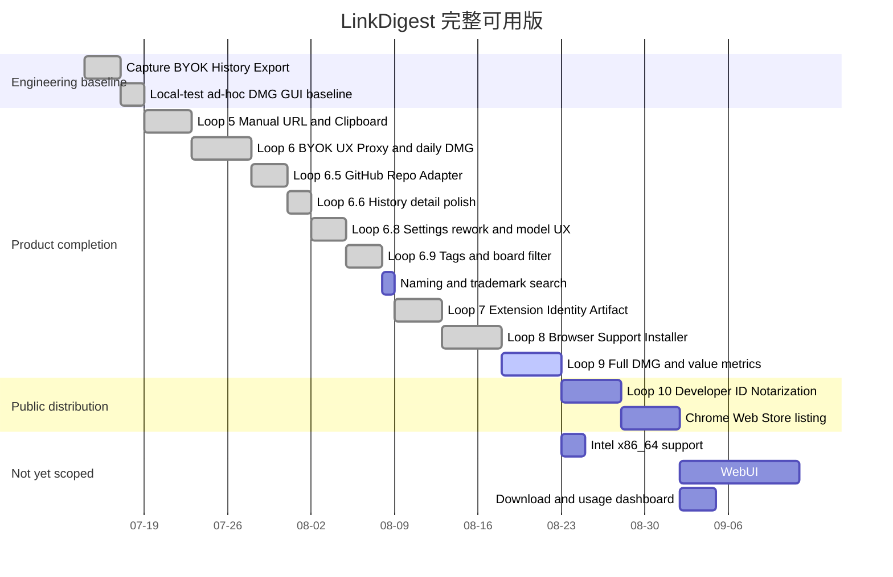

# Roadmap

## P0 完整可用 APP 顺序



> 日期只表达依赖顺序，不是交付承诺；真实凭据、HOME/profile 写入、签名、公证、商店与发布继续使用单独授权门禁。
>
> 甘特图里的 `done` 只表示**该 Loop 的代码已实现并有提交痕迹**，不表示验收完成。Loop 9 的价值指标未测量、Loop 10 未开始，产品与公开发布仍固定 `BLOCKED`。

## 已完成的工程基线

1. Chrome、Brave、Edge 的开发态 Capture → Native Messaging → SwiftUI 工程链。
2. BYOK profile、Keychain、Chat Completions SSE、停止与 secret hygiene。
3. GRDB/SQLite、History、删除和 Markdown/TXT/JSON 导出。
4. 数据目的地确认、连接测试和 local-test ad-hoc DMG/source handoff。
5. Syc 已真实打开 r4b GUI；该证据只关闭“DMG/App 可打开”，不关闭产品可用性。

## 当前状态

当前精确状态为 **GUI_BASELINE_PASS / PRODUCT_INCOMPLETE**；Loop 5 为 **CODE-COMPLETE / VERIFICATION-PENDING**（15 条公开样本补验依赖 Loop 6 代理兼容，现已具备条件，待补跑）。

**2026-08-01 分发路径现场核实**（影响 Loop 10 的范围，先记在此）：

- 当前 App 为 **ad-hoc 签名**，`spctl` 判定 `rejected`。但 `codesign --verify --deep --strict` 为 `valid on disk` 且满足 Designated Requirement，zip 打包往返后签名仍然有效——因此从网络下载后弹出的是**「无法验证开发者」（存在放行入口）**，而不是**「已损坏，应移到废纸篓」（无放行入口）**。这条区别决定了未签名分发是否可行，必须在每次改动打包流程后重新验证。
- **「右键打开」绕过入口在 macOS 15 (Sequoia) 已被移除**，而本 App 的 `LSMinimumSystemVersion` 为 15.0，故全部目标用户都无法使用该方式。未签名分发的唯一路径是：双击被拦 → 系统设置 › 隐私与安全性 › 底部「仍要打开」→ 再次确认。任何面向用户的安装说明都必须按这个流程写。

Loop 6：**工程侧已收口（2026-07-18 终审 PASS）**。Syc 用 r3-fix2 完成真实 BYOK 闭环（DeepSeek 连接、真实翻译、历史入库）；此后错误映射与"Provider 摘要透传"经四轮安全收敛，最终采纳 reviewer 架构建议：自由 Provider body 不跨 Adapter 边界，UI 仅用内部错误码固定文案（决策记录在 ARCHITECTURE.md）。最终 dogfood 候选 **r4-fix3**（DMG `b8fd3cee…30fa7c`，Swift 249/249、gate 76/10、SHA 13/13、18 文件绑定），r2→r4-fix2 全部 SUPERSEDED。剩余仅 Syc 换用 r4-fix3 的日常使用确认。验收发现的详情页元数据空壳与标签需求已转入 Loop 6.6 / 6.9。

## 产品 Loop 顺序（含 2026-07-17/18 规划补丁）

1. Loop 5 — Desktop Input：手动 URL、剪贴板、公开网页抓取、正文提取、失败恢复和 History/CurrentCapture 接线。**验收必须包含 PRD §12 的 20 条真实样本集**（10 静态含 1 条 GitHub README 基线、5 客户端渲染、3 登录可见页记录“引导扩展”降级路径、2 故意失败），并交付 Syc 确认的 GUI 结果图。
2. Loop 6 — BYOK Product UX：主流程可发现设置、真实连接、目的地确认、流式总结/翻译和兼容抽样。**验收含自定义总结 prompt（默认模板 + 用户自定义）与翻译目标语言可选**（不限英译中）。**验收含代理环境兼容（Syc 2026-07-17 确认）**：检测 fake-ip DNS（如 198.18.0.0/15）并给出人话提示与恢复动作；支持经系统代理按域名 CONNECT 连接，保留 SNI/证书名校验与 TLS 信任链，不得因代理放宽 SSRF 防护的其余部分。**Loop 6 结束必须产出一版 Syc 可日常真用的 local-test ad-hoc DMG**（在开启代理的真实环境下手动链接 → BYOK 总结/翻译 → History/导出闭环），作为日常 dogfood 基线，也是“自用 + 发安装包给他人”的最低可交付形态。收尾包含 Syc 验收触发的 UX 批次（侧边栏可收缩、App 图标、设置页四态状态机）与 402/404/4xx 错误映射修复。
3. **Loop 6.5 — GitHub 仓库适配器**（[[github-repo-source-adapter]]）：识别 `github.com/owner/repo` 链接走专属来源适配器——公开仓库 README 原文获取、Markdown 解析、仓库内联图片绝对地址解析与本地缓存展示。边界：只做 README 内联图片引用/缓存，不做通用媒体下载；私有仓库 token 属未来单独授权。该 Loop 同时确立“来源适配器”插件式接缝（fetcher/CapturedDocument 协议），作为后续 arXiv/博客等适配器的模板。
4. **Loop 6.6 — 历史详情精修（Syc 2026-07-18 批准）**：把已有数据接进 UI——详情页元数据填充（操作/模型/创建时间/状态），run 落库补记 Token 用量（SSE usage 块）与估算费用，列表行来源 favicon 与时间格式，对齐 Sam 级别的信息密度。不新增数据面，只做展示层与 run 元数据落库。
5. **Loop 6.8 — 设置页重构与模型体验（Syc 2026-07-17 批准）**：设置页重组为「模型服务」+「生成与数据」两 tab；常用厂商预设（OpenAI/DeepSeek/DeepInfra/OpenRouter/Groq/SiliconFlow/Ollama 本地/自定义，纯 BYOK 不内置任何 key）；`GET /models` 模型下拉 + 手填兜底（**必须复用现有 Provider 传输层与 URL 门禁，不得新开网络面**）；**输出语言统一**（“翻译目标语言”升级为全局输出语言，总结输出跟随）；翻译可选独立模型（默认与总结共用）；「数据去向」透明卡；**设置页允许 `http://127.0.0.1` 本地端点**（复用既有 allowLoopbackHTTP 白名单，仅限 loopback，支持 Ollama 等本地 chat/completions 服务）。随后小步：同语言检测置灰翻译、历史详情重新生成（可临时换模型）、截断透明标注、主流程当前模型可见。**明确不做**：温度/推理档位/长度参数、iCloud 同步、多 Profile 并存、可编辑翻译 prompt、Responses API 适配（opencodex 类本地代理暂不支持，等生态普及再评估）；ChatGPT 订阅接入不进近期 roadmap，仅观察“Sign in with ChatGPT”第三方 GA 后再评估。
6. **Loop 6.9 — 标签与看板筛选（Syc 2026-07-18 批准）**：标签数据表（schema migration）；总结/翻译时由模型产出建议标签（自动）+ 手动增删；侧边栏/看板视图按标签筛选文章。边界：单层标签不做层级，筛选为单选/多选交集，不做智能合集。
7. **命名检索（Loop 7 前置硬门禁）**：正式产品名、商标、域名与图标检索必须在 Loop 7 冻结扩展 ID 与扩展工件之前完成，避免身份冻结后返工。
8. Loop 7 — Extension Artifact：稳定扩展 ID、确定性 Chromium bundle/zip、版本和 Host 绑定。**登录页捕获（浏览器 Cookie 上下文）日常可用依赖本 Loop 与 Loop 8 完成**；在此之前扩展仅开发者模式可用（Syc 2026-07-18 知悉该排期约束）。
9. Loop 8 — Browser Support Installer：APP 内安装/修复/卸载，真实 current-user Host/manifest/receipt 事务与冲突确认。
10. Loop 9 — Integrated Full DMG：App、Host、扩展、安装入口、源码和证据统一交付，完成 Syc 三浏览器端到端测试。**产品价值指标（PRD §11.1）在 Loop 9 验收时测量**，未测量不得宣称达标。

Loop 10 仅处理 Developer ID、hardened runtime、公证、stapling 和公开分发，不反向阻塞 Syc 的本机完整可用版。

## 未规划项（2026-08-01 登记）

以下四项**此前不在本文件、README 或 PRD 的任何位置**，只存在于对话中。登记在此是为了让「还剩什么没做」有一个可查的地方，不代表已排期、已批准或已承诺。每一项真正开工前仍需 Syc 单独确认。

| 项目 | 现状（现场核实） | 为什么需要 | 阻塞什么 |
|---|---|---|---|
| **Chrome Web Store 上架** | 未开始。扩展目前只能用「开发者模式 → 加载已解压的扩展程序」安装 | 开发者模式安装对普通用户是最高的一道门槛，且 Chrome 每次启动都会弹「请停用以开发者模式运行的扩展程序」 | 非技术用户完成安装 |
| ~~**Intel（x86_64）支持**~~ | **已完成（2026-08-01）**，见下方「universal 构建」一节 | — | — |
| **WebUI** | **范围已定为「下载官网」并完成**（2026-08-01，见下方「官网」一节）。「网页版应用」与「远程查看历史」两种理解**未采纳，也未排期** | — | — |
| **下载与使用数据看板** | 未开始 | 想知道有多少人下载、有多少人真正用起来 | 见下方结论 |

**关于数据看板的结论（不建议现在做）**：GitHub Releases 每个附件自带 `download_count`，永久保留，一条命令即可读取：

```bash
gh api repos/Songxiaor/jizuo/releases \
  --jq '.[] | "\(.tag_name): \(.assets[] | "\(.name) \(.download_count)")"'
```

该数字在 GitHub 网页界面上不显示，只能经 API 获取，容易被误认为「没有统计」。仓库访问量在 Insights › Traffic，但**只保留 14 天**。

GitHub 无法回答的是「装成功了多少、卡在哪一步、留存如何」，那需要 App 主动回传遥测，涉及隐私声明、服务端与成本。在获得第一批真实用户之前，`download_count` + GitHub Issues 的真人反馈已经够用；等出现「下载量可观但无人反馈」的信号时再评估遥测。

## 发布前优化（2026-08-01）

按 Syc 指定的四个外部 skill（check-code / refactor-code / performance-engineer / optimize-codebase-performance）的方法论做的一轮。**未安装这些 skill**，只读取内容应用其流程。

**性能：测量后判定无需优化。** 用项目自带的 `LinkDigestHistoryBenchmark` 在 1 万条任务 / 1.5 万次运行下实测：历史列表分页 p95 = **1.66 ms**、单条详情 p95 = **0.32 ms**，阈值 300 ms。数据库层没有任何瓶颈，因此**没有做任何查询优化**——没有证据的优化不做。冷启动进程就绪 0.1 s，同样不是瓶颈。

**做了三件事**：

1. **许可证检查会假通过——已修**。`pnpm licenses list --json` 失败时也返回 JSON（`{"error":...}`），脚本直接对它取 keys，于是错误对象被当成「一个名叫 error 的许可证」，不匹配禁止模式，脚本便打印 `OK: every dependency has a permissive license path`。**发布前的合规检查在自己没跑成时报了通过**，比检查不通过危险得多。现在遇到 error 字段或空列表一律明确失败。
2. **密钥卫生的三处误报——已消除**。`unknown-code-visible-sink` 靠正则匹配 `code` 标识符名，无法区分「provider 原始文本」和「内部错误码」。实测三处命中全是业务错误码（B站 -101、YouTube 播放器码、内部 catalog 错误码经 `modelCatalogFailureText` 映射成固定文案——最后这处正是规则要求的正确做法）。**没有放宽正则**，改为支持逐行 `// secret-hygiene:reviewed` 豁免并要求写明理由。已红绿验证：插入真违规立刻被抓，还原后恢复 OK。
3. **品牌名收敛——为改名铺路**。见下节。

**评估后决定不做的**：把 `truncateCheckpoint` 接到 App 退出路径（可回收 3.7 MB WAL）。收益是磁盘空间与略快的启动，风险是在退出路径引入磁盘 IO，可能导致「App 退不掉」。收益/风险比不足，留待 Syc 决定。

**自检变化**：`scripts/doctor` 从 PASS=79/FAIL=6 变为 **PASS=80/FAIL=5**。剩余 5 项均为既有问题：Brain 文档系统 4 项、r4b 哈希 1 项，以及许可证检查因本机 pnpm store 索引缺失（`ERR_PNPM_MISSING_PACKAGE_INDEX_FILE`）无法运行——修它需要动跨项目共享的 `~/Library/pnpm/store`，未擅自执行。已用只读方式独立核实：455 个依赖包中 MIT 356、ISC 30、BSD 系列 32、Apache-2.0 23、MPL-2.0 4，**零高风险许可证**，两个双授权包均可选非 GPL 分支。合规本身没有问题。

## 隐性问题排查（2026-08-01 深夜）

针对「还没被发现的问题」做的一轮，重点是新用户路径、升级路径、改动间的相互影响。

**修掉的两个**：

1. **`reasoning_effort` 被拒后每片都重试一次**（自引入的问题）。降级标记原是
   `perform()` 内的局部变量，而长文翻译每片各发一次请求。对不接受该参数的服务商，
   9 片会变成 9 次「被拒」+ 9 次「重发」——**一半请求纯属浪费，每次还要等一个完整
   往返**。改为按 (baseURL, model) 记在 provider 实例上，换服务商或模型会重新试。
   已红绿验证。
2. **官网引入 Google Fonts**。两个理由任一条都够：一个主打「数据全部留在本机」的
   产品，官网却把每个访问者的 IP 交给 Google，与产品承诺自相矛盾；且目标用户以
   中文用户为主，而 Google Fonts 在中国大陆基本不可用，首屏会白到超时才回落。
   改用系统字体栈——中文本来就落在 PingFang SC 上，受影响的只有拉丁字形。
   现在**页面加载时零外部请求**（实测 `performance.getEntriesByType('resource')` 为 0）。

**查过确认没问题的**（记下来避免重复排查）：

- **取消传播**：分片并发下点停止，链路完整——流终止 → `work.cancel()` → 任务组取消
  → 子任务 `checkCancellation` → provider 取消 URLSession。没有漏网的在飞请求。
- **400 系列错误码映射**：未知参数导致的 400 落在 `providerRequestRejected`，正在降级
  白名单内，覆盖正确。
- **升级路径**：数据库 schema 未改动；旧安装存的 16 GB 上限会被收进新区间；旧的
  model-preferences JSON 缺新字段仍能解码。三条都有测试覆盖。
- **universal 下的资源完整性**：三处读 core bundle 的代码全部实测命中；两处读 App
  自身 bundle 的图标目录（PlatformIcons / ProviderIcons，24 个 SVG）打包正常。
- **全新用户**：无配置时有明确引导文案（「尚未配置模型」「验证并配置模型」）。

**发现但只能由 Syc 解决**：

- **仓库需要设为 Public**（诊断已定论，见下节）。
- 连带：官网下载按钮指向 `releases/latest`，而该仓库目前**没有任何 release**。
  发布时必须先建 release 并上传 DMG，否则按钮是死的。

## 文档与代码的不一致清单（2026-08-01 逐条核对）

把 PRD 与本文件里的规划条目**逐条拿去和代码对**，发现四处不一致。方法上有个教训：
最初靠猜关键词搜索，连着三次得出「未实现」的错误结论（同语言检测、当前模型可见、
媒体播放实际都在）。**关键词搜不到不等于没实现**——改为先定位 UI 文案或类名再回溯
代码，才得到可靠结果。

**一、PRD 承诺三浏览器，实际只剩 Chrome（对用户的承诺，最要紧）**

PRD §5.1 写着「Chrome、Brave、Edge 扩展可以读取用户主动触发的当前页面」，而
`BrowserRegistry` 里 `allKnown = [.chrome]`，Brave 与 Edge 已移入 `legacy`（曾经支持、
现在不提供）。原因在代码注释里：Edge 的档案目录第一段就是 app 名 `Microsoft Edge`，
写入被 macOS 直接拒（EPERM 且**不弹授权框**），用户手动授权也无效；Chrome 走
`Google/Chrome`，第一段是厂商目录，不在该保护规则内——「这不是我们做对了什么，
是目录命名的运气」。

**二、导出格式三处说法都不同**

实际支持 **7 种**：Markdown、纯文本 `.txt`、完整数据 `.json`、PDF、Word `.docx`、
脑图+原文 HTML、脑图 SVG。PRD 只列了前三种；**官网原本也只写了 MD/PDF/Word 且漏掉
JSON**（对在意数据自主的用户恰恰是卖点）——官网已修正。

**三、PRD §7「本阶段不做」列全线过时**

媒体播放、视频下载、收藏、本机 ASR、批量处理（批量总结/批量删除）全部已实现，
但仍列在「不做」栏里。

**四、Loop 6.8「随后小步」四项其实已全部完成**

同语言检测置灰翻译（`CapturedContentLanguage`，3 条测试全过）、历史详情临时换模型
重新生成、截断透明标注、主流程当前模型可见——本文件说是待办，代码里都在。

**未处理**：PRD 本体未改。它兼具验收证据性质，其中的历史陈述有追溯价值，改动方式
需 Syc 决定；此处先记录差异。

## 仓库公开前的核查（2026-08-01）

**诊断结论：仓库存在，是私有的**，不是「不存在」或「用户名写错」。证据链：

| 检查 | 结果 |
|---|---|
| 网络通路对照（`torvalds/linux`） | HTTP 200，通路正常 |
| `github.com/Songxiaor`（用户主页） | HTTP 200，账号存在 |
| `github.com/Songxiaor/linkdigest` 匿名 | **HTTP 404** |
| 该账号的公开仓库列表 | 11 个，**不含 linkdigest**，也无相近命名 |
| 本地 `git branch -r` | 有 5 个 origin 分支引用 |
| `origin/codex/p0-rc-02b-baseline` 指向 | `9eecd9e`，就在本地历史中 |

最后两行是决定性的：本地保有真实的远程跟踪引用，说明**曾经成功 push 过**——仓库
必然存在，只是匿名不可见。

**Syc 需要做的**：仓库 Settings › General › 最底部 Danger Zone › Change visibility →
Public。另需 `gh auth login` 重新登录（当前 token 已 invalid）。

**公开前的安全核查已做完，结论是可以安全公开**：

- **全部 89 个提交的历史内容**扫过高置信度密钥模式（`sk-*`、`gh[pousr]_*`、
  PRIVATE KEY、AWS AKIA）：**零命中**。
- 更宽的可疑赋值扫描：命中项全部是测试假值（`not-a-real-key`、
  `fake-key-for-catalog-only`、`must-not-be-written`）。
- 历史中的敏感文件名：只有 `KeychainSecretStore.swift` 与检查脚本本身，都是源码。

**公开后会一并可见、但不构成安全问题的**（Syc 知悉即可）：

- **硬编码的个人路径**。`scripts/build-and-deploy-local.py` 里的
  `/Users/song/Applications` **已改为 `Path.home() / "Applications"`**——它不只暴露
  用户名，还让任何克隆者直接不可用（脚本会去写他们机器上不存在的目录）。已验证解析
  结果在本机完全一致且部署实跑通过。`docs/` 下另有若干处（HANDOFF、ARCHITECTURE、
  LEARNING_LOG），属于历史记录，改动会让证据失真，**未动**。
- **扩展开发私钥的存放路径**出现在 `docs/ARCHITECTURE.md`。只是路径，私钥本体在仓库
  外且权限 0600，不构成泄露。
- **提交作者邮箱**：`107981494+Songxiaor@users.noreply.github.com` 与
  `synara@users.noreply.github.com` 都是 noreply，安全；另有
  `song@SongdeMacBook-Pro-2.local` 会暴露本机主机名。改它需要重写历史，风险大于收益，
  **建议不动**。

## 品牌名收敛（2026-08-01，为改名做准备）

产品显示名的唯一来源是 `Sources/LinkDigestCore/Resources/product-display.json` 的三个字段，由 `ProductDisplay` 读取。但界面文案里原本还有 **23 处硬编码** "LinkDigest"，改名时必须逐处手改，极易漏。

现已全部改为引用 `ProductDisplay.name`，**用户可见文案中的硬编码归零**。

**已验证**：把 JSON 里的 `displayName` 临时改成「改名验证」后重新构建，0 错误，编译产物 bundle 内的资源文件同步更新。（注意：验证不能用 `strings` 找中文字面量——那条路不可靠，见既有教训。）

**改名时仍需单独处理的技术标识**（故意不动，因为改动会破坏已安装用户）：

| 标识 | 当前值 | 改动后果 |
|---|---|---|
| Bundle ID | `com.syc.linkdigest` | 系统视为另一个 App，权限与偏好全部重来 |
| Native host 名 | `com.syc.linkdigest.v01` | 浏览器扩展立刻断连 |
| 扩展 ID | `fbpjhlcpfheecigibjghhodhhkgjdgma`（frozen） | 与 host `allowed_origins` 永久绑定 |
| 数据目录 | `~/Library/Application Support/LinkDigest` | 历史记录「消失」 |
| 偏好域 | `com.syc.linkdigest` | 所有设置重置 |

**结论：面向用户的改名只需改那一个 JSON 文件；上表的技术标识建议保持不变**，它们不出现在界面上。

## 官网（2026-08-01 完成，待补截图）

`site/index.html` 单文件自包含，配 `site/assets/icon.png`。用于 GitHub Pages 托管，是发布的必需配套——**没有它，用户下载后不知道怎么绕过 Gatekeeper**。

内容：产品说明、三步安装指南、6 条常见问题。全部基于现场核实的事实，**明确写了「右键打开在 macOS 15 已被移除」**，避免用户照抄过时教程。

视觉规格取自 Syc 指定的参考站 `fish.audio` 主站（红色促销弹窗与横幅不在参考范围）。不是凭印象模仿，是读取其计算样式后逐项对齐：

| | 参考站 | 本站 |
|---|---|---|
| 背景 | `rgb(250,248,245)` | 相同 |
| 字体 | Onest | 相同 |
| 主标题 | 48px / 字重 400 | 相同 |

其余照搬：纯白卡片 + 极细边框 + 圆角 14px、纯黑按钮（非彩色）、胶囊标签、左右分栏 hero、大留白。文案沿用其短句对比风格。

已验证：390px 宽（iPhone）下**零横向溢出**，布局自动堆叠。

**未完成**：页面留有「应用截图待补」占位。截图不能直接用本机 App——里面是真实浏览记录，公开等于公开个人浏览历史。需要 Syc 提供，或先造测试数据再截。

**发布方式**：仓库 Settings › Pages 选 `main` 分支 `/site` 目录；若 Pages 不支持该目录，改用 GitHub Actions 或把内容放到 `/docs`。

## universal 构建（2026-08-01 完成）

App 与 Native Host 现在都是 `arm64 + x86_64` 双架构，Intel Mac 可运行。构建方式是给 `swift build` 传两个 `--arch`，架构清单集中在 `stable_host.SUPPORTED_ARCHITECTURES`，两份 config（`config/native-host.json`、`config/app-release.json`）与校验脚本都引用它。

**这次改动暴露了三个只在 universal 下才出现的坑，都已修复并留了注释**：

1. **资源包布局会变**。单架构产出扁平包（`<包>/Resources/…`），universal 产出标准 macOS 包（`<包>/Contents/Resources/**Resources**/…`，多一层同名目录）。后果是 `Bundle.url(forResource:)` 在资源根找不到文件，`ProductDisplay.values` 的 `preconditionFailure` 在 SwiftUI 取 `App.body` 时触发——**App 启动即崩，崩在任何窗口出现之前**。`CoreResourceBundle` 与 `CaptureWireContractSchema` 现在都兼容两种布局。
2. **`main.swift` 不能与 `@main` 共存**。单架构构建能通过（走 WMO），universal 下直接编译失败。两个内部工具 target 的文件已改名。
3. **`LC_BUILD_VERSION` 会有多条**。universal 每个切片一条，原校验要求「恰好一个」。现在要求全部可解析**且完全一致**——切片间部署目标不一致会造成「一类 Mac 装得上、另一类起不来」这种最难查的故障。

**验证方式（以后改打包流程后照此重跑）**：

```bash
lipo -archs <App>/Contents/MacOS/LinkDigestApp        # 期望 x86_64 arm64
vtool -arch x86_64 -show-build-version <可执行文件>     # 每个切片 minos 都应为 15.0
codesign --verify --strict --all-architectures <App>  # 签名对所有切片有效
arch -x86_64 <NativeHost>                             # 用 Rosetta 实跑 Intel 切片
```

最后一条最关键：向 Intel 切片发一条合法 capture fixture，应返回 `taskAccepted`。这同时证明了「x86_64 可执行」与「新布局下资源能被找到」——**单元测试对后者永远是绿的，只有跑打包产物才验得出**。

## 已实现但未登记的功能

同一类问题的另一面：**下列功能代码已存在并在日常使用，但从未出现在本文件的 Loop 序列中**。它们是在 dogfood 过程中直接实现的。

- **脑图生成**（`MindMapSVGRenderer` / `MindMapOutline` / `MindMapStore`）：由总结产出结构化大纲并渲染 SVG，支持双主题、编辑与导出。
- **长文翻译分片并发**（`ChunkedTranslation`）：超长正文按段落切片并发翻译，片长按并发反算。
- **推理档位控制**：对总结/翻译请求发送 `reasoning_effort: low`，并在服务端拒绝该参数时自动降级重发。

**这两节的存在本身就是一个信号**：需求与实现都曾绕过本文件。任何新需求，即使当天就动手，也应先在此登记一行，否则「还剩什么没做」将永远只存在于记忆里。

## 下游硬门禁

- 手动 URL 的公开抓取不得使用浏览器 Cookie；登录或动态页面必须引导使用扩展。
- 代理兼容不得整体放宽 SSRF 防护：fake-ip 检测、经代理按域名连接时必须保留 hostname SNI、证书名校验与 system trust；不得允许直连私网/test-net 目标。
- API Key 只允许进入 Keychain 和单次短时 Provider 请求，不进入 SQLite、日志、截图、fixture、导出或 Git。
- Extension ID 必须与 Host `allowed_origins` 永久绑定；不得使用 wildcard。
- Production installer 只操作 LinkDigest 自有 basename/receipt；未知旧 manifest 必须显式确认、备份与可恢复，禁止静默覆盖。
- Chrome、Brave、Edge 的真实目录和行为必须现场验证；不得只沿用旧浏览器版本假设。
- Git、真实 Provider、真实 HOME/profile、Developer ID、公证、商店和公开发布继续分别受授权门禁约束。
