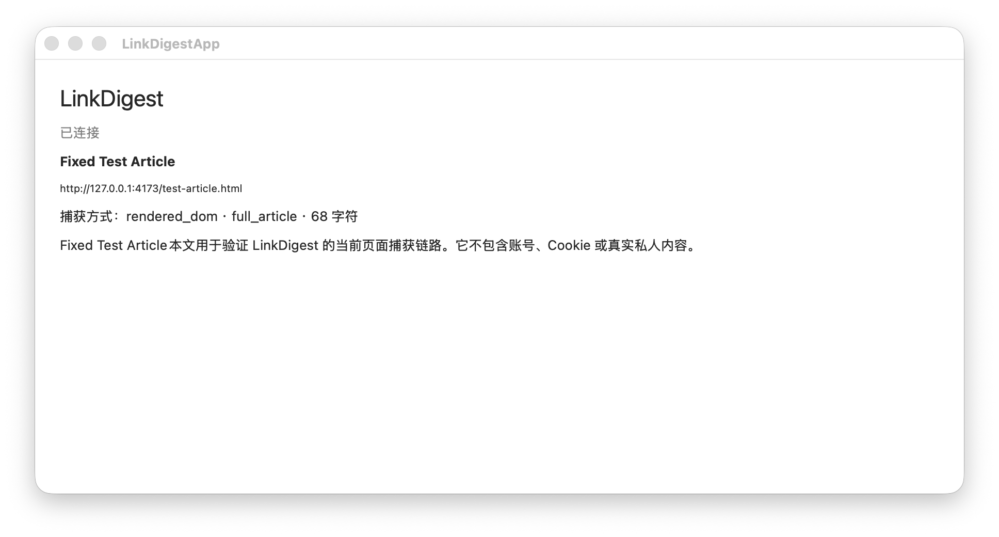

# V0.1 真实浏览器验收证据（2026-07-14）

## 固定输入

- 页面：`http://127.0.0.1:4173/test-article.html`
- 标题：`Fixed Test Article`
- 提取结果：`rendered_dom / full_article / 68 字符`
- 扩展 ID：`dpjfghbojjgoagocbjdpfpejhgfdojfh`
- Host/App：Swift Release build

## Chrome 150.0.7871.47

| 验收项 | 结果 |
|---|---|
| 隔离 Profile 加载与 Service Worker | 通过 |
| Popup 当前页预览 | `Fixed Test Article / 68 个字符` |
| APP 未运行 | `APP_UNAVAILABLE / open_app`，约 86.8 ms |
| APP 已运行单次 | `已发送`，约 93.8 ms |
| SwiftUI 可观察字段 | 已连接、标题、URL、捕获方式、完整性、68 字符、固定正文 |
| 连续 Release 发送 | 20/20，失败 0 |
| p95 / min / max | 49.2 / 10.3 / 82.4 ms |

原始 20 次样本（ms）：`[82.4, 25.6, 34.6, 49.2, 34.9, 24.8, 20.0, 15.3, 15.9, 15.8, 15.7, 14.3, 15.0, 14.4, 15.0, 11.0, 10.3, 14.6, 15.3, 15.3]`

## Brave 150.1.92.139

| 验收项 | 结果 |
|---|---|
| 隔离 Profile `Extensions.loadUnpacked` | LinkDigest 0.1.0，enabled=true |
| `Extensions.triggerAction` 与 Service Worker | 通过 |
| Popup 当前页预览 | `Fixed Test Article / 68 个字符` |
| APP 未运行 | `APP_UNAVAILABLE / open_app`，约 71.1 ms |
| APP 已运行单次 | `已发送`，约 55.9 ms |
| 连续 Release 发送 | 20/20，失败 0 |
| p95 / min / max | 34.9 / 9.7 / 70.1 ms |

原始 20 次样本（ms）：`[70.1, 34.9, 21.3, 13.6, 19.9, 14.3, 14.9, 10.4, 10.1, 9.7, 9.9, 14.7, 15.1, 15.3, 15.3, 14.5, 15.7, 15.4, 15.3, 10.0]`

Brave 验收只操作项目隔离 Profile；日常 Brave PID 47965 未关闭、隐藏、点击或读取。锁屏后使用 browser-level CDP `Extensions` domain，未尝试唤醒或解锁。

Brave 150 的 macOS 兼容逻辑会把用户级 Native Messaging 目录覆盖为 Chrome 的注册位置。本次真正生效的是 Chrome 用户目录中的 LinkDigest manifest；Brave 自己的同名目录未参与这次 Host 查找。该结论由现场进程时间线与 Brave 1.92.139 / Chromium 150 对应源码交叉确认，不外推为所有未来版本的永久行为。

## Native Host 交付边界

浏览器启动源码目录中的 Host 会触发 macOS `Documents` TCC。仅复制 executable 又会缺少 `LinkDigest_LinkDigestCore.bundle`，导致合同资源不可用。本次真实验收把 Release executable 和 resource bundle 成对暂存到 `/tmp/linkdigest-v01-test-501/`，并让 Chrome/Brave 的 LinkDigest 测试 manifest 指向同一 Host。

这证明了垂直链路，但不是正式安装方案。发布前仍需把两者放入签名 App 或经 Syc 确认的非隐私安装位置，并验证备份、卸载、签名与公证。

## 未完成

- Microsoft Edge 本机未安装；未获授权安装外部软件，因此未执行 Edge 验收。
- 未购买、发布、提交商店、创建账号或修改签名身份。
- 未读取 Cookie、浏览历史、账号数据或其它 Native Messaging manifest。

## Native Host 脚本回归（隔离 HOME）

本轮安装边界修正后运行 `pnpm native-host:check`：

- `--browser` 缺失或传入 `all` 会拒绝；Chrome、Brave、Edge 必须显式选择。
- Brave 目标与 Chrome 目标去重到 `Google/Chrome/NativeMessagingHosts`，没有写入 `BraveSoftware` 目录；Edge 只做显式 dry-run 检查。
- 使用临时 `HOME` 验证 executable、resource bundle、Schema 校验、非法 ID/相对路径/缺 browser/缺 bundle/缺 Schema 拒绝、目标与路径组件 symlink 拒绝、目标文件 `0600`、覆盖前唯一时间戳备份、备份候选 symlink 不跟随和同目录 rename 设计。
- 通过替换隔离测试中的 `mv` 验证失败临时文件由 trap 保留并打印路径；测试不自动删除残留。
- `uninstall-plan.sh` 输出目标状态、备份和人工命令；前后文件清单一致，未执行删除或其它写操作，最后只报告“不读取文件内容、不修改”。

测试沙盒由脚本创建并保留，命令输出会打印 `TEST_SANDBOX=...`；真实 HOME、真实浏览器目录和其它 manifest 未触碰。
